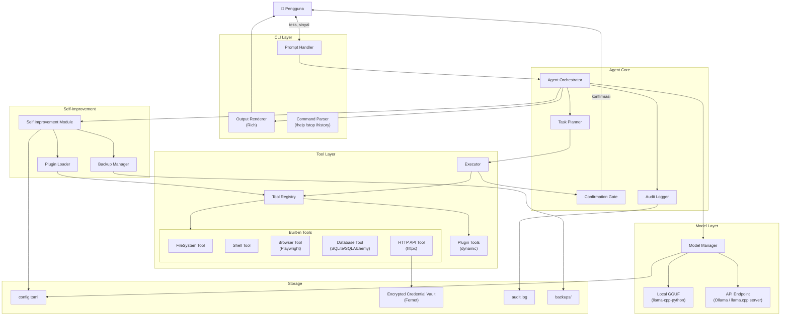
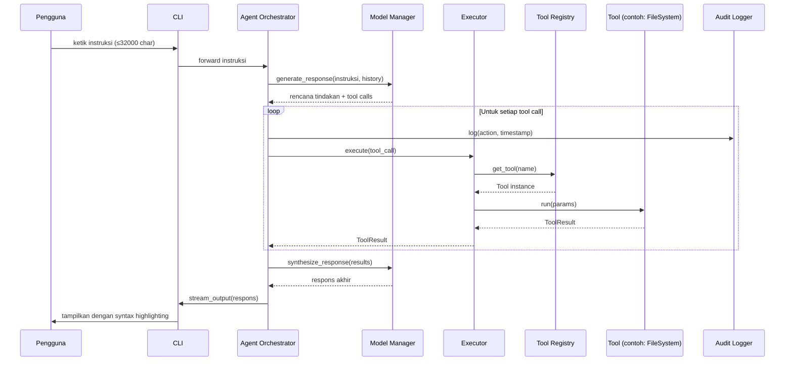
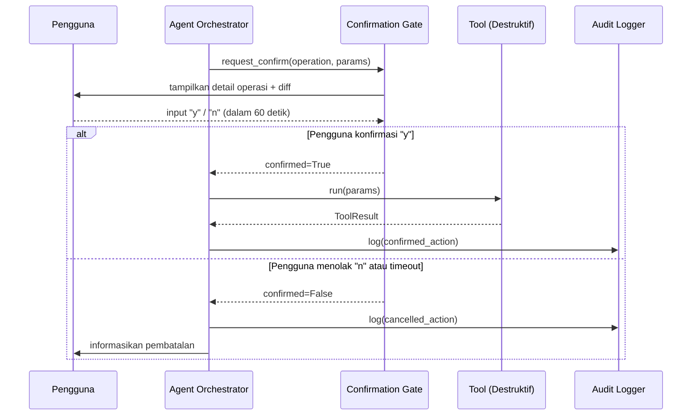
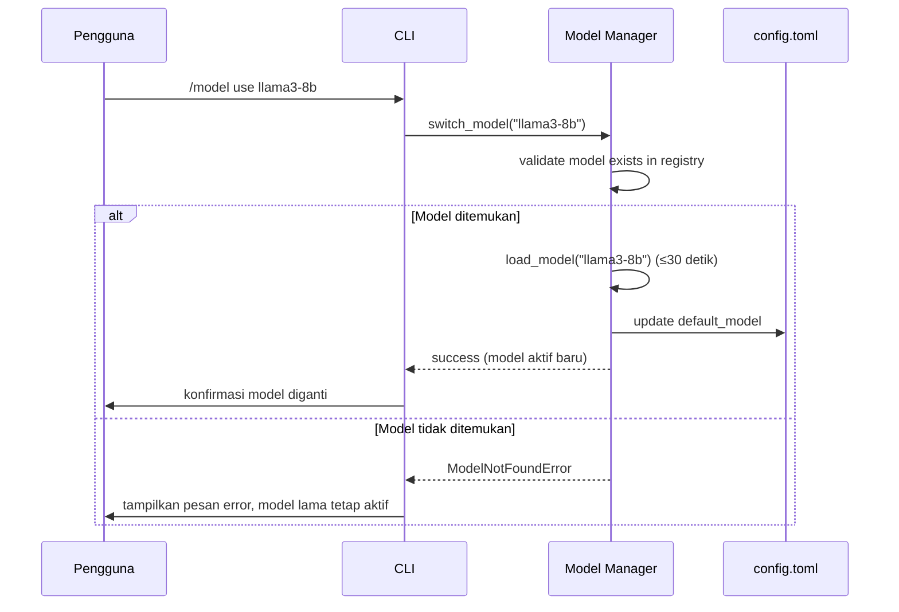

# Design Document: Local AI Agent

## Overview

Local AI Agent adalah sistem agen kecerdasan buatan berbasis terminal yang berjalan sepenuhnya di mesin lokal pengguna. Sistem ini dirancang untuk memproses instruksi bahasa alami dan menjalankan tindakan nyata pada komputer pengguna—membaca/menulis file, menjalankan perintah shell, mengakses web, berinteraksi dengan database lokal, dan memanggil API eksternal—tanpa ketergantungan pada server cloud.

### Keputusan Teknologi

| Komponen | Teknologi | Alasan |
|---|---|---|
| Bahasa | Python 3.11+ | Ekosistem AI terkaya, stdlib lengkap untuk filesystem/subprocess/sqlite, komunitas besar |
| Terminal UI | [Rich](https://github.com/Textualize/rich) | Syntax highlighting, spinner, layout panel tanpa deps berat |
| LLM lokal (GGUF) | [llama-cpp-python](https://github.com/abetlen/llama-cpp-python) | Binding C++ langsung ke llama.cpp, mendukung semua format GGUF |
| LLM via API | [httpx](https://www.python-httpx.org/) (async) | HTTP/1.1 + HTTP/2, async-first, cocok untuk Ollama dan llama.cpp server |
| Browser headless | [Playwright](https://playwright.dev/python/) | API Python resmi, reliable, mendukung Chromium tanpa display |
| Database | sqlite3 (stdlib) + [SQLAlchemy](https://www.sqlalchemy.org/) Core | sqlite3 untuk SQLite ringan; SQLAlchemy untuk PostgreSQL/MySQL multi-driver |
| Konfigurasi | TOML ([tomllib](https://docs.python.org/3/library/tomllib.html)/tomli-w) | Stdlib Python 3.11+, lebih mudah dibaca manusia daripada JSON |
| Enkripsi credential | [cryptography](https://cryptography.io/) (Fernet) | Enkripsi simetris teruji, satu library resmi |
| Plugin loading | Python `importlib` (stdlib) | Dynamic loading tanpa deps tambahan |
| Sandbox (opsional) | Docker via `docker` SDK atau `subprocess` dengan restricted env | Isolasi proses tanpa overhead VM |
| Property testing | [Hypothesis](https://hypothesis.readthedocs.io/) | Library PBT terbaik di ekosistem Python |

### Prinsip Arsitektur

1. **Modular by design**: Setiap subsistem (CLI, Executor, Tool_Registry, dsb.) adalah modul Python terpisah dengan antarmuka yang terdefinisi.
2. **Safety-first**: Setiap operasi destruktif melewati `Confirmation_Gate` sebelum dieksekusi.
3. **Fully local**: Tidak ada data yang dikirim ke server eksternal tanpa izin eksplisit pengguna.
4. **Graceful degradation**: Kegagalan pada satu tool/plugin tidak menghentikan sesi keseluruhan.
5. **Audit trail**: Semua tindakan tercatat ke log dengan timestamp ISO 8601.

---

## Architecture

### Diagram Komponen



### Sequence Diagram: Alur Eksekusi Instruksi Normal



### Sequence Diagram: Alur dengan Confirmation Gate



### Sequence Diagram: Model Hot-Swap



---

## Components and Interfaces

### CLI

```python
# agent/cli/interface.py
from dataclasses import dataclass
from typing import AsyncIterator
from rich.console import Console

@dataclass
class CLIConfig:
    model: str | None = None          # dari flag --model
    history_limit: int = 1000

class CLI:
    def __init__(self, config: CLIConfig, console: Console) -> None: ...

    async def run(self) -> None:
        """Loop utama REPL: baca input → kirim ke Agent → render output."""

    async def handle_command(self, text: str) -> bool:
        """Tangani built-in command (/help, /stop, /history, /model, /tools).
        Kembalikan True jika teks adalah command yang diproses."""

    def render_stream(self, token_stream: AsyncIterator[str]) -> None:
        """Render token stream dengan syntax highlighting via Rich."""

    def show_history(self, session_history: list["InteractionRecord"]) -> None:
        """Tampilkan semua pasangan instruksi-respons dari sesi aktif."""

    def show_spinner(self, active: bool) -> None:
        """Tampilkan/matikan indikator status setiap 200ms."""

    def validate_input_length(self, text: str) -> bool:
        """Kembalikan True jika len(text) ≤ 32000."""
```

### Agent Orchestrator

```python
# agent/core/orchestrator.py
from dataclasses import dataclass, field
from typing import Any

@dataclass
class InteractionRecord:
    instruction: str
    response: str
    tool_calls: list["ToolCall"] = field(default_factory=list)
    timestamp: str = ""  # ISO 8601

class Agent:
    def __init__(
        self,
        model_manager: "ModelManager",
        executor: "Executor",
        confirmation_gate: "ConfirmationGate",
        audit_logger: "AuditLogger",
        blocklist: "Blocklist",
    ) -> None: ...

    async def process(self, instruction: str) -> AsyncIterator[str]:
        """Proses instruksi: plan → execute tools → synthesize → stream respons."""

    async def stop(self) -> None:
        """Hentikan semua operasi dalam ≤3 detik."""

    def get_history(self) -> list[InteractionRecord]:
        """Kembalikan riwayat interaksi sesi aktif."""

    async def _execute_plan(self, plan: "TaskPlan") -> list["ToolResult"]:
        """Eksekusi setiap tool call dari rencana secara berurutan.
        Berhenti setelah 10 tindakan berurutan dan minta konfirmasi."""
```

### Executor

```python
# agent/core/executor.py
from dataclasses import dataclass
from typing import Any

@dataclass
class ToolCall:
    tool_name: str
    params: dict[str, Any]

@dataclass
class ToolResult:
    success: bool
    data: Any
    error: str | None = None

class Executor:
    def __init__(
        self,
        registry: "ToolRegistry",
        confirmation_gate: "ConfirmationGate",
        sandbox: "Sandbox | None" = None,
    ) -> None: ...

    async def execute(self, call: ToolCall) -> ToolResult:
        """Ambil tool dari registry, validasi blocklist, jalankan tool.
        Tangkap semua exception dari plugin tanpa menghentikan sesi."""

    def is_destructive(self, call: ToolCall) -> bool:
        """Periksa apakah tool call memerlukan konfirmasi."""
```

### Tool Registry

```python
# agent/tools/registry.py
from dataclasses import dataclass
from typing import Protocol, runtime_checkable

MAX_TOOLS = 200
MAX_PLUGIN_FILE_SIZE_BYTES = 100 * 1024 * 1024  # 100 MB

@runtime_checkable
class ToolInterface(Protocol):
    name: str
    description: str
    input_schema: dict
    output_schema: dict

    async def run(self, params: dict) -> ToolResult: ...

@dataclass
class ToolEntry:
    tool: ToolInterface
    enabled: bool = True
    source: str = "builtin"  # "builtin" | "plugin"

class ToolRegistry:
    def __init__(self) -> None:
        self._tools: dict[str, ToolEntry] = {}

    def register(self, tool: ToolInterface, source: str = "builtin") -> None:
        """Daftarkan tool. Tolak jika total melebihi 200 atau skema tidak valid."""

    def get(self, name: str) -> ToolInterface | None:
        """Kembalikan tool aktif berdasarkan nama, atau None jika tidak ada."""

    def list_all(self) -> list[ToolEntry]:
        """Kembalikan semua tool beserta status aktif/nonaktifnya."""

    def enable(self, name: str) -> None:
        """Aktifkan tool. Raise ToolNotFoundError jika nama tidak ada."""

    def disable(self, name: str) -> None:
        """Nonaktifkan tool. Raise ToolNotFoundError jika nama tidak ada."""

    def validate_plugin_schema(self, tool: object) -> list[str]:
        """Validasi bahwa tool memenuhi ToolInterface. Kembalikan list field yang kurang."""

    def select_best(self, task_description: str) -> ToolInterface | None:
        """Pilih tool paling sesuai berdasarkan kecocokan deskripsi dengan skema."""
```

### Built-in Tools

```python
# agent/tools/filesystem.py
class FileSystemTool:
    name = "filesystem"
    MAX_READ_BYTES = 500 * 1024 * 1024  # 500 MB

    async def read_file(self, path: str) -> bytes: ...
    async def write_file(self, path: str, content: bytes) -> None: ...
    async def create(self, path: str, is_dir: bool = False) -> None: ...
    async def delete(self, path: str) -> None:
        """Selalu melalui ConfirmationGate sebelum eksekusi."""
    async def move(self, src: str, dst: str) -> None:
        """Raise ConflictError jika dst sudah ada, tanpa mengubah file."""
    async def list_dir(self, path: str) -> list["FileEntry"]: ...
    async def glob_search(self, directory: str, pattern: str) -> list[str]: ...

# agent/tools/shell.py
DESTRUCTIVE_PATTERNS = [
    r"rm\s+-[rf]",   r"rmdir\s+/s",  r"format\s+",
    r"shutdown",      r"del\s+/[fs]", r"mkfs\.",
    r"dd\s+if=",
]

class ShellTool:
    name = "shell"
    DEFAULT_TIMEOUT_SECONDS = 30

    async def run_command(
        self,
        command: str,
        timeout: int = DEFAULT_TIMEOUT_SECONDS,
    ) -> "ShellResult": ...

    async def run_script(
        self,
        interpreter: str,
        script_path: str,
        timeout: int = DEFAULT_TIMEOUT_SECONDS,
    ) -> "ShellResult": ...

    async def start_background(self, command: str) -> "BackgroundProcess": ...
    def is_destructive(self, command: str) -> bool: ...

# agent/tools/browser.py
class BrowserTool:
    name = "browser"
    REQUEST_TIMEOUT_SECONDS = 30

    async def fetch_html(self, url: str) -> str:
        """Kembalikan konten HTML sebagai string UTF-8."""
    async def extract_content(self, html: str) -> "ExtractedContent": ...
    async def fill_form(self, url: str, selectors: dict[str, str]) -> None: ...
    async def click_element(self, url: str, selector: str) -> None: ...
    async def screenshot(self, url: str, output_path: str) -> str: ...
    async def set_cookies(self, domain: str, cookies: dict) -> None: ...

# agent/tools/database.py
class DatabaseTool:
    name = "database"
    MAX_SELECT_ROWS = 1000

    async def connect(self, connection_string: str) -> None:
        """Validasi path/string koneksi. Raise jika tidak valid."""
    async def select(self, query: str) -> list[dict]: ...
    async def execute_dml(self, query: str) -> None:
        """Selalu melalui ConfirmationGate sebelum eksekusi."""
    async def get_schema(self) -> "DatabaseSchema": ...
    async def disconnect(self) -> None: ...

# agent/tools/http_api.py
class HTTPAPITool:
    name = "http_api"
    MAX_BODY_BYTES = 10 * 1024 * 1024   # 10 MB
    REQUEST_TIMEOUT_SECONDS = 30
    MAX_REDIRECTS = 10

    async def request(
        self,
        method: str,   # GET | POST | PUT | PATCH | DELETE
        url: str,
        headers: dict[str, str] | None = None,
        params: dict[str, str] | None = None,
        body: bytes | str | None = None,
    ) -> "HTTPResponse": ...

    def get_credential(self, key: str) -> str:
        """Ambil credential dari CredentialVault. Nilai tidak pernah di-log."""
    def store_credential(self, key: str, value: str) -> None:
        """Enkripsi dan simpan credential ke vault."""
```

### Model Manager

```python
# agent/models/manager.py
from dataclasses import dataclass

MAX_GGUF_SIZE_BYTES = 100 * 1024 * 1024 * 1024  # 100 GB
MODEL_LOAD_TIMEOUT_SECONDS = 10
MODEL_SWITCH_TIMEOUT_SECONDS = 30

@dataclass
class ModelConfig:
    name: str
    model_type: str   # "gguf" | "api"
    path_or_url: str
    size_bytes: int | None = None

@dataclass
class ModelParameters:
    temperature: float   # 0.0 – 2.0
    context_length: int  # 128 – 131072

class ModelManager:
    def __init__(self, config_path: str) -> None: ...

    def list_models(self) -> list[ModelConfig]:
        """Kembalikan semua model terdaftar dalam ≤2 detik."""

    async def switch_model(self, name: str) -> None:
        """Ganti model aktif dalam ≤30 detik.
        Raise ModelNotFoundError jika nama tidak ada.
        Pertahankan model lama jika gagal dimuat dalam 10 detik."""

    def get_active_model(self) -> ModelConfig: ...

    async def generate(
        self,
        prompt: str,
        history: list,
    ) -> AsyncIterator[str]:
        """Stream token dari model aktif."""

    def update_parameters(self, params: ModelParameters) -> None:
        """Validasi rentang nilai sebelum menyimpan ke konfigurasi."""

    def set_default(self, name: str) -> None:
        """Simpan model default ke config.toml."""

    def load_config(self) -> None:
        """Muat ulang konfigurasi dari config.toml (digunakan saat startup)."""
```

### Confirmation Gate

```python
# agent/core/confirmation_gate.py
from dataclasses import dataclass
from typing import Callable

CONFIRMATION_TIMEOUT_SECONDS = 60

@dataclass
class ConfirmationRequest:
    operation_type: str
    description: str
    diff: str | None = None  # untuk perubahan konfigurasi
    full_command: str | None = None  # untuk shell commands

class ConfirmationGate:
    def __init__(self, input_fn: Callable[[], str] | None = None) -> None:
        """input_fn dapat di-inject untuk testing."""

    async def request(self, req: ConfirmationRequest) -> bool:
        """Tampilkan detail operasi, tunggu "y"/"n" dari pengguna.
        Auto-cancel dan kembalikan False setelah 60 detik tanpa input."""
```

### Self-Improvement Module

```python
# agent/self_improvement/module.py
from pathlib import Path

MAX_BACKUP_VERSIONS = 10
MAX_PLUGIN_DOWNLOAD_BYTES = 500 * 1024 * 1024  # 500 MB
APPLY_TIMEOUT_SECONDS = 30

class SelfImprovementModule:
    def __init__(
        self,
        config_path: Path,
        registry: "ToolRegistry",
        confirmation_gate: "ConfirmationGate",
        backup_manager: "BackupManager",
    ) -> None: ...

    def read_config(self) -> dict:
        """Baca konfigurasi Agent yang aktif."""

    async def propose_change(self, instruction: str) -> "ConfigProposal":
        """Analisis instruksi dan hasilkan proposal perubahan beserta diff."""

    async def apply_change(self, proposal: "ConfigProposal") -> None:
        """Buat backup → tampilkan diff via ConfirmationGate → terapkan.
        Rollback otomatis jika gagal dalam APPLY_TIMEOUT_SECONDS."""

    async def download_plugin(self, url: str, name: str) -> None:
        """Unduh plugin (≤500 MB), validasi skema, daftarkan ke registry."""

    async def rollback(self) -> None:
        """Pulihkan ke versi backup terakhir dalam ≤30 detik."""

class BackupManager:
    def __init__(self, backup_dir: Path) -> None: ...

    def create_backup(self, config: dict) -> str:
        """Buat backup dan kembalikan path backup. Pruning ke 10 versi terbaru."""

    def get_latest(self) -> dict | None:
        """Kembalikan backup terakhir atau None jika tidak ada."""

    def list_backups(self) -> list[Path]:
        """Kembalikan semua backup diurutkan dari terbaru, maks 10."""
```

### Audit Logger

```python
# agent/core/audit_logger.py
from pathlib import Path
import logging

MAX_LOG_SIZE_BYTES = 100 * 1024 * 1024  # 100 MB

class AuditLogger:
    def __init__(self, log_path: Path) -> None:
        """Konfigurasi RotatingFileHandler dengan maxBytes=100MB."""

    def log_action(
        self,
        action: str,
        params: dict,
        result: str,
        confirmed: bool = True,
    ) -> None:
        """Catat tindakan dengan timestamp ISO 8601.
        Pastikan nilai credential tidak tercatat."""

    def log_error(self, error: str, context: dict) -> None: ...
```

### Blocklist

```python
# agent/core/blocklist.py
from dataclasses import dataclass
from enum import Enum

class BlocklistEntryType(Enum):
    FILE_PATH = "file_path"
    COMMAND = "command"
    DOMAIN = "domain"

@dataclass
class BlocklistEntry:
    entry_type: BlocklistEntryType
    pattern: str   # exact match atau glob untuk path, substring untuk command/domain

class Blocklist:
    def __init__(self, blocklist_path: str | None = None) -> None: ...

    def is_blocked(self, entry_type: BlocklistEntryType, value: str) -> bool:
        """Kembalikan True jika value cocok dengan entri dalam blocklist."""

    def load_from_file(self, path: str) -> None: ...
    def add_entry(self, entry: BlocklistEntry) -> None: ...
```

---

## Data Models

```python
# agent/models/schemas.py
from dataclasses import dataclass, field
from typing import Any

# --- File System ---

@dataclass
class FileEntry:
    path: str
    name: str
    size_bytes: int
    modified_at: str    # ISO 8601
    entry_type: str     # "file" | "directory"

# --- Shell ---

@dataclass
class ShellResult:
    exit_code: int
    stdout: str
    stderr: str
    timed_out: bool = False
    command: str = ""

@dataclass
class BackgroundProcess:
    pid: int
    command: str
    status: str    # "running" | "stopped" | "error"
    exit_code: int | None = None

# --- Browser ---

@dataclass
class ExtractedContent:
    text: str
    links: list[str]
    structured_data: list[dict]  # list item dari schema.org, JSON-LD, dsb.

# --- Database ---

@dataclass
class ColumnInfo:
    name: str
    data_type: str
    is_primary_key: bool
    is_nullable: bool
    is_unique: bool

@dataclass
class TableSchema:
    name: str
    columns: list[ColumnInfo]

@dataclass
class DatabaseSchema:
    tables: list[TableSchema]

# --- HTTP API ---

@dataclass
class HTTPResponse:
    status_code: int
    headers: dict[str, str]
    body: bytes
    final_url: str          # URL setelah semua redirect
    redirect_count: int

# --- Config ---

@dataclass
class CredentialEntry:
    key: str
    encrypted_value: bytes   # Fernet-encrypted, tidak pernah diekspos sebagai plaintext

@dataclass
class AgentConfig:
    default_model: str
    models: list["ModelConfig"]
    tool_directories: list[str]
    blocklist_path: str | None
    sandbox_enabled: bool
    shell_timeout_seconds: int = 30
    log_path: str = "audit.log"
    max_consecutive_actions: int = 10

# --- Self-Improvement ---

@dataclass
class ConfigProposal:
    description: str
    diff: str               # unified diff format
    old_config: dict
    new_config: dict
    requires_restart: bool = False

# --- Agent Planning ---

@dataclass
class TaskPlan:
    original_instruction: str
    steps: list["ToolCall"]
    reasoning: str

@dataclass
class ToolCall:
    tool_name: str
    params: dict[str, Any]
    requires_confirmation: bool = False

@dataclass
class ToolResult:
    success: bool
    data: Any
    error: str | None = None
    tool_name: str = ""
```

---

## Correctness Properties

*A property is a characteristic or behavior that should hold true across all valid executions of a system — essentially, a formal statement about what the system should do. Properties serve as the bridge between human-readable specifications and machine-verifiable correctness guarantees.*

### Property 1: Batas Panjang Input CLI

*For any* string yang dikirimkan ke `CLI.validate_input_length`, metode tersebut SHALL mengembalikan `True` jika dan hanya jika panjang string ≤ 32.000 karakter.

**Validates: Requirements 1.1**

---

### Property 2: Riwayat Sesi Lengkap dan Berurutan

*For any* urutan N instruksi yang diproses dalam satu sesi, pemanggilan `/history` SHALL mengembalikan tepat N pasangan instruksi-respons dalam urutan yang sama persis (dari terlama ke terbaru).

**Validates: Requirements 1.9**

---

### Property 3: Confirmation Gate Selalu Dipanggil untuk Operasi Berisiko Tinggi

*For any* operasi yang termasuk kategori berisiko tinggi (penghapusan file/direktori, query DML/DDL database, perintah shell destruktif, perubahan komponen Agent), `ConfirmationGate.request` SHALL selalu dipanggil sebelum operasi tersebut dieksekusi — tanpa terkecuali.

**Validates: Requirements 2.4, 3.4, 5.4, 8.2, 10.1**

---

### Property 4: Round-Trip Tulis-Baca File

*For any* konten byte arbitrer yang ditulis ke path file yang valid, membaca kembali file tersebut SHALL menghasilkan konten yang identik (byte-for-byte) dengan konten yang ditulis.

**Validates: Requirements 2.2**

---

### Property 5: Pencarian Glob Hanya Mengembalikan File yang Cocok

*For any* direktori dan pola glob yang valid, setiap path yang dikembalikan oleh `FileSystemTool.glob_search` SHALL cocok dengan pola tersebut, dan tidak ada file yang cocok SHALL dihilangkan dari hasil.

**Validates: Requirements 2.8**

---

### Property 6: Shell Result Selalu Memiliki Tiga Komponen

*For any* perintah shell yang dieksekusi (berhasil atau gagal), `ShellTool.run_command` SHALL selalu mengembalikan `ShellResult` yang mengandung tiga field: `exit_code` (integer), `stdout` (string), dan `stderr` (string) — masing-masing terpisah dan tidak digabungkan.

**Validates: Requirements 3.1, 3.2**

---

### Property 7: Credential Tidak Pernah Muncul di Output

*For any* credential yang disimpan via `HTTPAPITool.store_credential` dengan key K dan value V, nilai V tidak boleh muncul di output terminal, file log, atau respons Agent dalam kondisi apapun selama sesi berlangsung.

**Validates: Requirements 6.4, 10.5**

---

### Property 8: Redirect Diikuti Hingga Batas Maksimum

*For any* URL yang menghasilkan rantai redirect dengan panjang N:
- Jika N ≤ 10: `HTTPAPITool.request` SHALL mencapai URL tujuan akhir dan mengembalikan respons dari URL tersebut.
- Jika N > 10: `HTTPAPITool.request` SHALL menghentikan request dan mengembalikan error yang menyebutkan jumlah redirect yang terjadi serta URL terakhir yang dikunjungi.

**Validates: Requirements 6.6, 6.7**

---

### Property 9: Backup Tidak Melebihi Sepuluh Versi

*For any* jumlah N perubahan yang diterapkan oleh `SelfImprovementModule.apply_change` (dengan N > 0), jumlah versi backup yang tersimpan SHALL selalu sama dengan `min(N, 10)` — versi tertua dipangkas secara otomatis ketika batas 10 terlampaui.

**Validates: Requirements 8.7**

---

### Property 10: Isolasi Error Plugin Tidak Menghentikan Sesi

*For any* plugin yang terdaftar di `ToolRegistry` yang melempar exception apapun saat `run()` dipanggil, `Executor` SHALL menangkap exception tersebut, mencatatnya ke `AuditLogger`, dan mengembalikan `ToolResult(success=False, error=<pesan error>)` — tanpa menyebabkan sesi Agent berakhir atau interaksi berikutnya gagal.

**Validates: Requirements 9.8**

---

## Error Handling

### Kode Error Internal

| Kode | Nama | Deskripsi |
|---|---|---|
| `E001` | `FileNotFoundError` | Path file/direktori tidak ditemukan |
| `E002` | `PermissionDeniedError` | Izin akses file/shell ditolak OS |
| `E003` | `FileSizeExceededError` | Ukuran file melampaui batas maksimum |
| `E004` | `PathConflictError` | Path tujuan operasi move/rename sudah ada |
| `E005` | `ShellTimeoutError` | Perintah shell melampaui batas waktu |
| `E006` | `DestructiveCommandError` | Perintah destruktif tanpa konfirmasi (internal) |
| `E007` | `BrowserFetchError` | Gagal mengambil URL (HTTP error / timeout / koneksi) |
| `E008` | `DatabaseConnectionError` | Path SQLite tidak valid atau connection string tidak dapat dijangkau |
| `E009` | `QueryExecutionError` | Query SQL gagal dieksekusi oleh database engine |
| `E010` | `HTTPRequestError` | HTTP request timeout atau network error |
| `E011` | `RedirectLimitExceededError` | Jumlah redirect melebihi 10 |
| `E012` | `ModelNotFoundError` | Nama model tidak ada dalam registry |
| `E013` | `ModelLoadTimeoutError` | Model gagal dimuat dalam 10 detik |
| `E014` | `PluginSchemaError` | Plugin tidak memenuhi skema ToolInterface |
| `E015` | `PluginSizeExceededError` | File plugin melampaui batas ukuran |
| `E016` | `ModelParameterRangeError` | Nilai parameter model di luar rentang valid |
| `E017` | `CapacityExceededError` | Tool_Registry sudah penuh (200 tools) |
| `E018` | `BlocklistViolationError` | Operasi ditolak karena entri dalam blocklist |
| `E019` | `ConfirmationTimeoutError` | Pengguna tidak merespons dalam 60 detik |
| `E020` | `SelfImprovementApplyError` | Gagal menerapkan perubahan, rollback otomatis dipicu |

### Strategi Penanganan Error

**Prinsip umum:**
- Semua error dikembalikan kepada `Agent` sebagai `ToolResult(success=False, error=<pesan>)`.
- Error tidak pernah menghentikan sesi secara tiba-tiba kecuali `/stop` atau Ctrl+C dipanggil eksplisit.
- Setiap error dicatat ke `AuditLogger` dengan konteks penuh (tool name, params, error code).
- Pesan error yang ditampilkan kepada pengguna selalu menyebut: jenis kegagalan + entitas yang terlibat (path/URL/query/nama model).

**Skenario spesifik:**

```
FileSystem
├── File tidak ditemukan     → E001, sertakan path dalam pesan, hentikan operasi
├── Izin ditolak             → E002, sertakan path, kembalikan ke Agent
├── Path conflict (move)     → E004, sertakan path dst yang konflik, tanpa modifikasi file
└── File >500 MB             → E003, sertakan ukuran aktual vs batas

Shell
├── Timeout                  → E005, kill proses, kembalikan pesan dengan command + durasi timeout
└── Destructive tanpa konfirmasi → E006 (tidak seharusnya terjadi, hanya sebagai safeguard)

Database
├── Path SQLite invalid      → E008, jangan buat file baru
├── Query gagal              → E009, sertakan query asli, state DB tidak berubah
└── Bukan file SQLite        → E008 dengan jenis kegagalan = "invalid_sqlite_file"

HTTP API
├── Timeout (>30 detik)      → E010, sertakan URL dan durasi timeout
└── Redirect >10             → E011, sertakan jumlah redirect dan URL terakhir

Model Manager
├── Model tidak ditemukan    → E012, pertahankan model aktif
└── Load timeout (>10 detik) → E013, pertahankan model sebelumnya

Self-Improvement
├── Apply gagal              → E020, trigger rollback otomatis, informasikan pengguna
└── Plugin tidak sesuai skema → E014, sertakan field yang tidak sesuai

Confirmation Gate
└── Timeout 60 detik         → E019, batalkan operasi, informasikan pengguna
```

---

## Testing Strategy

### Pendekatan Pengujian Ganda

Pengujian menggunakan dua lapisan yang saling melengkapi:

1. **Unit tests (pytest)**: Memverifikasi perilaku spesifik pada contoh konkret, edge case, dan kondisi error.
2. **Property-based tests (Hypothesis)**: Memverifikasi properti universal yang harus berlaku untuk semua input yang valid.

PBT cocok untuk fitur ini karena:
- Banyak fungsi inti bersifat murni (pure function) dengan input/output yang jelas.
- Ada banyak properti universal yang harus berlaku (round-trips, batas kapasitas, isolasi error).
- Input space yang besar (string arbitrary, path file, query SQL, HTTP requests).

### Library yang Digunakan

```toml
# pyproject.toml (dependencies testing)
[project.optional-dependencies]
test = [
    "pytest>=8.0",
    "pytest-asyncio>=0.23",
    "hypothesis>=6.100",
    "pytest-mock>=3.12",
    "playwright>=1.40",   # untuk integration test browser
]
```

### Unit Tests

Unit tests difokuskan pada:
- Perilaku CLI (parsing command, validasi panjang input, render history)
- Logika ConfirmationGate (timeout, input "y"/"n")
- Logika Blocklist (matching path, command, domain)
- Tool Registry (register, enable/disable, kapasitas)
- Error messages (format dan kelengkapan)
- Model Manager (parsing config, hot-swap logic)

Contoh:
```python
# tests/unit/test_cli.py
def test_validate_input_length_at_boundary():
    cli = CLI(CLIConfig(), console=Console())
    assert cli.validate_input_length("a" * 32000) is True
    assert cli.validate_input_length("a" * 32001) is False

def test_stop_when_idle_exits_cleanly():
    # Tidak ada error yang dilempar ketika /stop dipanggil saat idle
    ...
```

### Property-Based Tests (Hypothesis)

Konfigurasi minimum 100 iterasi per properti. Setiap test diberi tag yang merujuk pada properti di dokumen desain ini.

```python
# tests/property/test_cli_properties.py
from hypothesis import given, settings
from hypothesis import strategies as st

# Feature: local-ai-agent, Property 1: Batas Panjang Input CLI
@given(text=st.text(min_size=0, max_size=40000))
@settings(max_examples=200)
def test_input_length_validation(text):
    cli = CLI(CLIConfig(), console=Console(quiet=True))
    result = cli.validate_input_length(text)
    assert result == (len(text) <= 32000)
```

```python
# tests/property/test_filesystem_properties.py
from hypothesis import given, settings
from hypothesis import strategies as st
import tempfile, os

# Feature: local-ai-agent, Property 4: Round-Trip Tulis-Baca File
@given(content=st.binary(min_size=0, max_size=10 * 1024))
@settings(max_examples=200)
async def test_file_write_read_roundtrip(content):
    tool = FileSystemTool()
    with tempfile.NamedTemporaryFile(delete=False) as f:
        path = f.name
    try:
        await tool.write_file(path, content)
        result = await tool.read_file(path)
        assert result == content
    finally:
        os.unlink(path)

# Feature: local-ai-agent, Property 5: Pencarian Glob Hanya Mengembalikan File yang Cocok
@given(
    filenames=st.lists(
        st.text(alphabet=st.characters(whitelist_categories=("Ll", "Lu", "Nd")), min_size=1, max_size=20),
        min_size=1, max_size=20, unique=True,
    )
)
@settings(max_examples=100)
async def test_glob_search_returns_only_matching(filenames):
    tool = FileSystemTool()
    with tempfile.TemporaryDirectory() as tmpdir:
        py_files = [f + ".py" for f in filenames[:len(filenames)//2]]
        txt_files = [f + ".txt" for f in filenames[len(filenames)//2:]]
        for name in py_files + txt_files:
            open(os.path.join(tmpdir, name), "w").close()
        results = await tool.glob_search(tmpdir, "*.py")
        result_names = [os.path.basename(r) for r in results]
        assert all(r.endswith(".py") for r in result_names)
        assert set(result_names) == set(py_files)
```

```python
# tests/property/test_shell_properties.py
from hypothesis import given, settings
from hypothesis import strategies as st

# Feature: local-ai-agent, Property 6: Shell Result Selalu Memiliki Tiga Komponen
@given(
    cmd=st.sampled_from(["echo hello", "echo error 1>&2; exit 1", "true", "false"])
)
@settings(max_examples=100)
async def test_shell_result_always_has_three_components(cmd):
    tool = ShellTool()
    result = await tool.run_command(cmd, timeout=5)
    assert isinstance(result.exit_code, int)
    assert isinstance(result.stdout, str)
    assert isinstance(result.stderr, str)
```

```python
# tests/property/test_http_properties.py
from hypothesis import given, settings
from hypothesis import strategies as st

# Feature: local-ai-agent, Property 7: Credential Tidak Pernah Muncul di Output
@given(
    key=st.text(min_size=1, max_size=50),
    value=st.text(min_size=8, max_size=100),
)
@settings(max_examples=200)
def test_credential_never_exposed(key, value, captured_output):
    tool = HTTPAPITool(vault=CredentialVault())
    tool.store_credential(key, value)
    # Simulasikan berbagai output paths
    output = get_all_output_from_tool(tool)
    assert value not in output

# Feature: local-ai-agent, Property 8: Redirect Diikuti Hingga Batas Maksimum
@given(redirect_count=st.integers(min_value=1, max_value=15))
@settings(max_examples=100)
async def test_redirect_chain_behavior(redirect_count, mock_redirect_server):
    tool = HTTPAPITool()
    if redirect_count <= 10:
        result = await tool.request("GET", mock_redirect_server.url(redirect_count))
        assert result.redirect_count == redirect_count
        assert result.status_code == 200
    else:
        with pytest.raises(RedirectLimitExceededError) as exc_info:
            await tool.request("GET", mock_redirect_server.url(redirect_count))
        assert str(redirect_count) in str(exc_info.value)
```

```python
# tests/property/test_self_improvement_properties.py
from hypothesis import given, settings
from hypothesis import strategies as st

# Feature: local-ai-agent, Property 9: Backup Tidak Melebihi Sepuluh Versi
@given(n_changes=st.integers(min_value=1, max_value=25))
@settings(max_examples=100)
async def test_backup_count_invariant(n_changes, tmp_path):
    backup_mgr = BackupManager(backup_dir=tmp_path / "backups")
    for i in range(n_changes):
        backup_mgr.create_backup({"version": i})
    backups = backup_mgr.list_backups()
    assert len(backups) == min(n_changes, 10)
```

```python
# tests/property/test_executor_properties.py
from hypothesis import given, settings
from hypothesis import strategies as st

# Feature: local-ai-agent, Property 10: Isolasi Error Plugin Tidak Menghentikan Sesi
@given(
    error_type=st.sampled_from([
        ValueError, RuntimeError, OSError, KeyError, Exception
    ])
)
@settings(max_examples=100)
async def test_plugin_error_isolation(error_type):
    broken_plugin = BrokenPlugin(raises=error_type("test error"))
    registry = ToolRegistry()
    registry.register(broken_plugin, source="plugin")
    executor = Executor(registry=registry, confirmation_gate=mock_gate)
    result = await executor.execute(ToolCall(tool_name=broken_plugin.name, params={}))
    assert result.success is False
    assert result.error is not None
    # Sesi tidak berhenti — executor masih bisa menerima call berikutnya
    result2 = await executor.execute(ToolCall(tool_name="noop_tool", params={}))
    assert result2 is not None
```

### Integration Tests

Integration test digunakan untuk:
- Latency CLI (500ms display, 200ms spinner, 1s background output)
- Model hot-swap tanpa restart
- ConfirmationGate timeout 60 detik
- Headless browser dengan Playwright
- Koneksi database PostgreSQL/MySQL via SQLAlchemy
- Sandbox isolasi Docker

```python
# tests/integration/test_confirmation_gate.py
async def test_confirmation_timeout_auto_cancels(mock_clock):
    gate = ConfirmationGate(input_fn=lambda: asyncio.sleep(999))
    with mock_clock.fast_forward(61):
        result = await gate.request(ConfirmationRequest(
            operation_type="delete",
            description="Delete /tmp/test.txt",
        ))
    assert result is False  # auto-cancelled
```

### Smoke Tests

Smoke test untuk konfigurasi dan environment:
- Agent berjalan sepenuhnya offline dengan model GGUF lokal
- Headless browser berjalan tanpa display environment
- Sandbox (Docker) tersedia jika dikonfigurasi
- Tidak ada outbound network traffic tanpa izin eksplisit

### Struktur Direktori Testing

```
tests/
├── unit/
│   ├── test_cli.py
│   ├── test_confirmation_gate.py
│   ├── test_blocklist.py
│   ├── test_tool_registry.py
│   └── test_model_manager.py
├── property/
│   ├── test_cli_properties.py          # Property 1, 2
│   ├── test_filesystem_properties.py   # Property 3 (partial), 4, 5
│   ├── test_shell_properties.py        # Property 3 (partial), 6
│   ├── test_http_properties.py         # Property 7, 8
│   ├── test_self_improvement_properties.py  # Property 9
│   └── test_executor_properties.py     # Property 10
├── integration/
│   ├── test_confirmation_gate.py
│   ├── test_model_hotswap.py
│   ├── test_browser.py
│   └── test_database.py
└── smoke/
    ├── test_offline_operation.py
    └── test_sandbox.py
```

### Menjalankan Tests

```bash
# Unit tests saja (cepat)
pytest tests/unit/ -v

# Property tests (lebih lambat, min 100 iterasi per properti)
pytest tests/property/ -v

# Semua tests kecuali integration dan smoke
pytest tests/unit/ tests/property/ -v

# Semua tests
pytest tests/ -v

# Dengan coverage report
pytest tests/unit/ tests/property/ --cov=agent --cov-report=html
```
