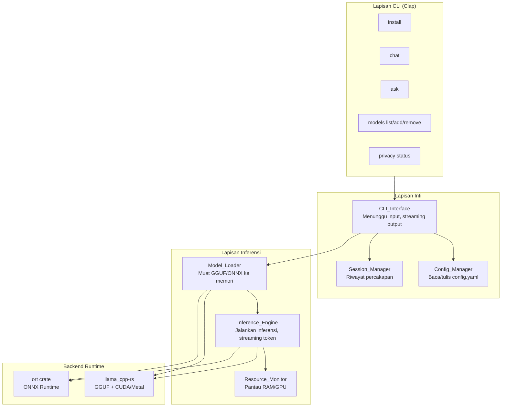
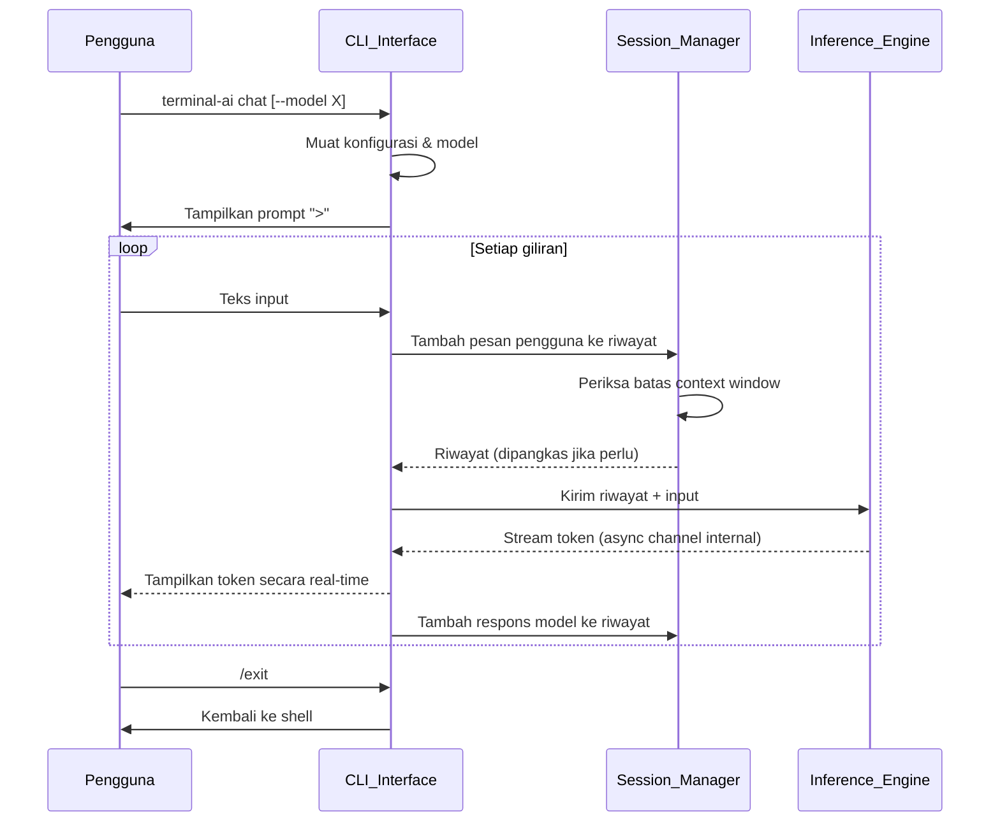
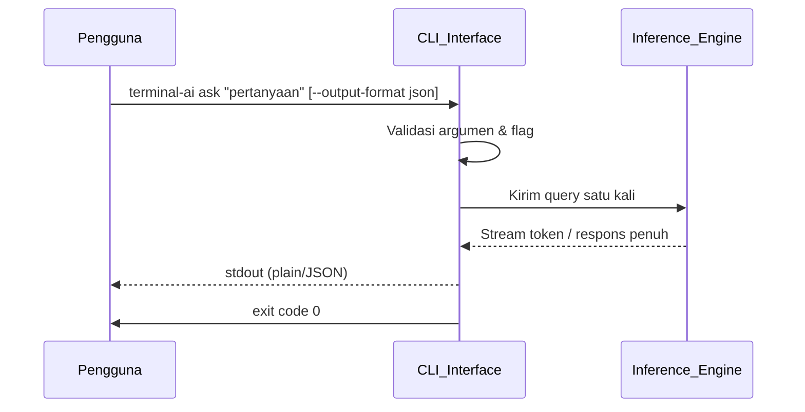

# Design Document: Terminal AI Model

## Overview

Terminal AI Model adalah aplikasi CLI berbasis Rust yang memungkinkan pengguna menjalankan model bahasa besar (LLM) secara lokal di terminal. Aplikasi ini dirancang untuk menjalankan model dalam format GGUF (melalui llama.cpp) dan ONNX (melalui ONNX Runtime) tanpa ketergantungan pada layanan cloud atau koneksi internet.

### Keputusan Teknologi Utama

**Bahasa Implementasi: Rust**

Rust dipilih karena beberapa alasan teknis:
- Kontrol memori deterministik tanpa garbage collector — kritis untuk aplikasi yang mengelola model berukuran ~5GB di RAM.
- Ekosistem binding llama.cpp yang matang: crate [`llama_cpp-rs`](https://github.com/edgenai/llama_cpp-rs) menyediakan binding Rust yang aman dan bertingkat tinggi ke llama.cpp.
- Crate [`ort`](https://ort.pyke.io/) menyediakan binding yang aktif dikelola untuk ONNX Runtime.
- Performa native tanpa overhead subprocess atau GC pause.
- Kompilasi cross-platform ke binary statis untuk Linux (x86_64/ARM64), macOS, dan Windows.

**Runtime Inferensi: llama.cpp via FFI (primer), ONNX Runtime via FFI (sekunder)**

Integrasi FFI langsung dipilih dibanding subprocess `llama-server` karena:
- Menghindari latensi IPC dan overhead HTTP untuk setiap token.
- Kontrol penuh atas siklus hidup model dan alokasi memori.
- Kemampuan membaca statistik inferensi secara langsung (token/s, waktu first-token).

### Gambaran Alur Kerja

```
Pengguna → CLI (Clap) → Config_Manager → Model_Loader → Inference_Engine → Output
                           ↓                                    ↑
                    ~/.config/terminal-ai/            Session_Manager
                         config.yaml                  (riwayat chat)
```

---

## Architecture

### Diagram Komponen



### Diagram Alur: Mode Chat



### Diagram Alur: Mode Ask



---

## Components and Interfaces

### 1. CLI_Interface

Komponen utama yang menangani parsing argumen, presentasi output, dan orkestrasi komponen lain. Diimplementasikan menggunakan crate `clap` dengan derive macros.

**Perintah yang didukung:**

| Perintah | Deskripsi | Flag Utama |
|---|---|---|
| `install` | Unduh model default | — |
| `chat` | Mode percakapan interaktif | `--model`, `--temperature`, `--max-tokens`, `--context-size`, `--system-prompt`, `--system-prompt-file`, `--context-file`, `--gpu-layers`, `--cpu-only`, `--threads` |
| `ask <pertanyaan>` | Mode query satu baris | Semua flag `chat` + `--no-stream`, `--output-format`, `--verbose` |
| `models list` | Daftar model terinstal | — |
| `models add <path>` | Daftarkan model lokal | — |
| `models remove <nama>` | Hapus model dari daftar | — |
| `privacy status` | Tampilkan status privasi | — |
| `--help` | Tampilkan bantuan | — |

**Antarmuka Rust (trait utama):**

```rust
pub trait CliCommand {
    async fn execute(&self, ctx: &AppContext) -> Result<ExitCode, AppError>;
}
```

### 2. Config_Manager

Mengelola file konfigurasi YAML di `~/.config/terminal-ai/config.yaml` dan registri model di `~/.config/terminal-ai/models.json`.

**Antarmuka:**

```rust
pub trait ConfigManager {
    fn load() -> Result<AppConfig, ConfigError>;
    fn save(config: &AppConfig) -> Result<(), ConfigError>;
    fn ensure_directories() -> Result<(), ConfigError>;
    fn default_model_dir() -> PathBuf;
}
```

**Nilai default konfigurasi:**

| Parameter | Nilai Default |
|---|---|
| `temperature` | 0.7 |
| `max_tokens` | 2048 |
| `context_size` | 4096 |
| `default_model` | `default` |
| `model_dir` | `~/.config/terminal-ai/models/` |

### 3. Model_Loader

Bertanggung jawab untuk memvalidasi, mendaftarkan, dan memuat file model ke dalam memori dengan backend yang sesuai.

**Antarmuka:**

```rust
pub trait ModelLoader {
    fn validate_model_file(path: &Path) -> Result<ModelMetadata, ModelError>;
    async fn load_model(
        name: &str,
        params: &LoadParams,
    ) -> Result<Arc<dyn ModelHandle>, ModelError>;
    fn list_models() -> Result<Vec<ModelEntry>, ModelError>;
    fn add_model(path: &Path, name: Option<&str>) -> Result<ModelEntry, ModelError>;
    fn remove_model(name: &str) -> Result<(), ModelError>;
}
```

**Deteksi format model:**
- File `.gguf` → backend `llama_cpp-rs`
- File `.onnx` → backend `ort`
- Format lain → error dengan pesan deskriptif

**Parameter pemuatan model:**

```rust
pub struct LoadParams {
    pub gpu_layers: Option<i32>,   // None = otomatis, 0 = CPU only
    pub cpu_only: bool,
    pub threads: Option<usize>,
    pub context_size: u32,
    pub verbose: bool,
}
```

### 4. Inference_Engine

Mengelola siklus hidup inferensi: menyusun prompt, mengirim ke backend, dan streaming token ke output.

**Antarmuka:**

```rust
pub trait InferenceEngine {
    async fn infer_stream(
        &self,
        request: &InferenceRequest,
        tx: mpsc::Sender<InferenceEvent>,
    ) -> Result<InferenceStats, InferenceError>;

    async fn infer_blocking(
        &self,
        request: &InferenceRequest,
    ) -> Result<InferenceResult, InferenceError>;
}

pub enum InferenceEvent {
    Token(String),
    Done(InferenceStats),
    Error(InferenceError),
}

pub struct InferenceStats {
    pub token_count: usize,
    pub tokens_per_second: f64,
    pub duration_ms: u64,
    pub first_token_ms: u64,
}
```

**Manajemen context window:**

Ketika riwayat percakapan melebihi batas context window, `Session_Manager` memangkas pesan paling lama secara berurutan (FIFO) hingga total token berada dalam batas yang ditentukan. System prompt selalu dipertahankan dan tidak ikut dipangkas.

### 5. Session_Manager

Mengelola riwayat percakapan dalam memori selama sesi aktif.

**Antarmuka:**

```rust
pub struct SessionManager {
    messages: VecDeque<Message>,
    max_messages: usize,      // batas: 10.000 pesan
    context_token_limit: u32,
}

impl SessionManager {
    pub fn add_message(&mut self, role: Role, content: String);
    pub fn get_history_within_context(&self, limit: u32) -> Vec<Message>;
    pub fn clear(&mut self);
    pub fn save_to_file(&self, path: &Path) -> Result<(), SessionError>;
    pub fn token_count_estimate(&self) -> u32;
}
```

**Format penyimpanan sesi (JSON):**

```json
{
  "version": "1",
  "created_at": "2024-01-01T00:00:00Z",
  "model": "nama-model",
  "messages": [
    {"role": "user", "content": "...", "timestamp": "..."},
    {"role": "assistant", "content": "...", "timestamp": "..."}
  ]
}
```

### 6. Resource_Monitor

Memantau penggunaan RAM dan GPU untuk menegakkan batas 90% RAM serta memilih strategi offload GPU secara otomatis.

**Antarmuka:**

```rust
pub struct ResourceMonitor;

impl ResourceMonitor {
    pub fn available_ram_bytes() -> u64;
    pub fn total_ram_bytes() -> u64;
    pub fn available_vram_bytes() -> Option<u64>;
    pub fn detect_gpu_backend() -> GpuBackend;
    pub fn cpu_core_count() -> usize;
}

pub enum GpuBackend {
    Cuda,
    Metal,
    None,
}
```

---

## Data Models

### AppConfig

```rust
#[derive(Serialize, Deserialize, Debug)]
pub struct AppConfig {
    pub default_model: String,
    pub model_dir: PathBuf,
    pub temperature: f32,         // 0.0 – 2.0, default: 0.7
    pub max_tokens: u32,          // 1 – 8192, default: 2048
    pub context_size: u32,        // 512 – 131072, default: 4096
    pub gpu_layers: Option<i32>,  // None = otomatis
    pub threads: Option<usize>,   // None = deteksi otomatis
}
```

### ModelEntry (registri model)

```rust
#[derive(Serialize, Deserialize, Debug, Clone)]
pub struct ModelEntry {
    pub name: String,
    pub path: PathBuf,
    pub format: ModelFormat,
    pub quantization: Option<String>, // "Q4_K_M", "Q8_0", dll.
    pub size_bytes: u64,
    pub registered_at: DateTime<Utc>,
}

#[derive(Serialize, Deserialize, Debug, Clone, PartialEq)]
pub enum ModelFormat {
    Gguf,
    Onnx,
}
```

### InferenceRequest

```rust
#[derive(Debug)]
pub struct InferenceRequest {
    pub messages: Vec<Message>,
    pub system_prompt: Option<String>,
    pub context_file_content: Option<String>,
    pub params: InferenceParams,
}

#[derive(Debug, Clone)]
pub struct InferenceParams {
    pub temperature: f32,
    pub max_tokens: u32,
    pub context_size: u32,
    pub stream: bool,
}
```

### Message

```rust
#[derive(Serialize, Deserialize, Debug, Clone)]
pub struct Message {
    pub role: Role,
    pub content: String,
    pub timestamp: DateTime<Utc>,
}

#[derive(Serialize, Deserialize, Debug, Clone, PartialEq)]
#[serde(rename_all = "lowercase")]
pub enum Role {
    System,
    User,
    Assistant,
}
```

### AskJsonOutput (output `--output-format json`)

```rust
#[derive(Serialize, Debug)]
pub struct AskJsonOutput {
    pub query: String,
    pub response: String,
    pub model: String,
    pub duration_ms: u64,
}
```

### AppError (hierarki error)

```rust
#[derive(Debug, thiserror::Error)]
pub enum AppError {
    #[error("Config error: {0}")]
    Config(#[from] ConfigError),
    #[error("Model error: {0}")]
    Model(#[from] ModelError),
    #[error("Inference error: {0}")]
    Inference(#[from] InferenceError),
    #[error("Session error: {0}")]
    Session(#[from] SessionError),
    #[error("Validation error: {0}")]
    Validation(String),
    #[error("IO error: {0}")]
    Io(#[from] std::io::Error),
}
```

---

## Correctness Properties

*Sebuah properti adalah karakteristik atau perilaku yang harus berlaku di seluruh eksekusi sistem yang valid — pada dasarnya, pernyataan formal tentang apa yang harus dilakukan sistem. Properti menjadi jembatan antara spesifikasi yang dapat dibaca manusia dan jaminan kebenaran yang dapat diverifikasi oleh mesin.*

### Property 1: Validasi batas parameter inferensi numerik

*Untuk setiap* nilai parameter numerik yang diberikan ke flag `--temperature` (rentang valid 0.0–2.0), `--max-tokens` (rentang valid 1–8192), `--context-size` (rentang valid 512–131072), atau `--gpu-layers` (rentang valid 0–jumlah total layer), jika nilai berada di luar rentang yang valid maka CLI_Interface harus menolak eksekusi dan mengembalikan exit code 1; jika nilai berada dalam rentang yang valid, CLI_Interface harus menerimanya dan melanjutkan eksekusi.

**Validates: Requirements 5.1, 5.2, 5.3, 5.6, 5.7, 5.8, 6.5**

---

### Property 2: Penambahan model memperluas daftar dan dapat ditemukan kembali

*Untuk setiap* path file yang berformat GGUF atau ONNX dan dapat dibaca, menjalankan `models add` harus menghasilkan daftar model dengan panjang bertambah tepat satu, dan entri baru tersebut harus dapat ditemukan dalam daftar dengan path yang sama persis.

**Validates: Requirements 2.4**

---

### Property 3: Penghapusan model memperkecil daftar dan nama hilang

*Untuk setiap* nama model yang terdaftar dalam daftar model, menjalankan `models remove` dan mengonfirmasi penghapusan harus menghasilkan daftar model dengan panjang berkurang tepat satu, dan nama model tersebut tidak boleh ditemukan lagi dalam daftar setelah penghapusan.

**Validates: Requirements 2.3, 2.6**

---

### Property 4: Serialisasi riwayat sesi adalah round-trip yang ekuivalen

*Untuk setiap* riwayat sesi yang terdiri dari sekumpulan pesan dengan role dan konten yang beragam (termasuk karakter Unicode dan teks multibaris), menyimpan riwayat ke file JSON menggunakan `/save` kemudian memuat ulang file tersebut harus menghasilkan urutan pesan yang identik dengan riwayat asli — role, konten, dan urutan yang sama persis.

**Validates: Requirements 3.7, 10.5**

---

### Property 5: Pemangkasan context window mempertahankan suffix pesan terbaru

*Untuk setiap* riwayat percakapan yang total estimasi tokennya melebihi batas context window yang dikonfigurasi, setelah operasi pemangkasan, kumpulan pesan yang tersisa harus merupakan pesan-pesan paling baru (suffix) dari riwayat asli secara berurutan, bukan subset acak; dan system prompt harus selalu dipertahankan terlepas dari kondisi pemangkasan.

**Validates: Requirements 3.3, 3.4**

---

### Property 6: `/clear` selalu menghasilkan riwayat kosong

*Untuk setiap* riwayat sesi aktif dengan jumlah pesan yang berapa pun (termasuk riwayat yang sudah kosong), menjalankan perintah `/clear` harus menghasilkan riwayat sesi yang sepenuhnya kosong — panjang daftar pesan menjadi nol.

**Validates: Requirements 3.6**

---

### Property 7: Output JSON `ask` selalu memuat semua field wajib dengan tipe yang benar

*Untuk setiap* query yang dieksekusi dengan flag `--output-format json`, respons yang dicetak ke stdout harus berupa JSON yang valid secara sintaksis dan selalu memuat keempat field wajib dengan tipe yang benar: `query` (string), `response` (string), `model` (string), dan `duration_ms` (integer non-negatif dalam satuan milidetik).

**Validates: Requirements 4.6**

---

### Property 8: Verifikasi SHA-256 menerima data yang benar dan menolak data yang rusak

*Untuk setiap* pasangan (data bytes, nilai SHA-256), fungsi verifikasi checksum harus mengembalikan sukses jika dan hanya jika nilai SHA-256 yang diberikan sesuai dengan hash aktual dari data bytes tersebut; dan mengembalikan error untuk setiap nilai SHA-256 yang tidak cocok.

**Validates: Requirements 1.3, 1.4**

---

### Property 9: Pemangkasan konten file konteks menghasilkan prefix yang valid

*Untuk setiap* konten file konteks yang panjangnya (dalam token) melebihi 50% dari context window model yang dikonfigurasi, hasil pemangkasan harus berupa prefix dari konten asli (dipotong dari akhir teks), dan panjang hasil pemangkasan dalam token harus kurang dari atau sama dengan 50% batas context window.

**Validates: Requirements 9.5**

---

### Property 10: Tidak ada penyimpanan riwayat otomatis tanpa perintah `/save` eksplisit

*Untuk setiap* sesi percakapan aktif yang berjalan tanpa pengguna menjalankan perintah `/save`, setelah sesi berakhir tidak boleh ada file riwayat baru yang dibuat di sistem file — Config_Manager tidak boleh menyimpan riwayat percakapan secara diam-diam di lokasi mana pun.

**Validates: Requirements 10.4**

---

## Error Handling

### Strategi Penanganan Error

Semua error direpresentasikan sebagai tipe `AppError` yang diturunkan menggunakan crate `thiserror`. Error disebarkan menggunakan operator `?` dan ditangkap di titik entry CLI untuk diterjemahkan ke exit code dan pesan yang tepat.

### Tabel Exit Code

| Kondisi | Exit Code | Saluran Output |
|---|---|---|
| Sukses | 0 | stdout |
| Error validasi argumen/flag | 1 | stderr |
| Model tidak ditemukan | 1 | stderr |
| Error I/O (file tidak bisa dibaca/ditulis) | 1 | stderr |
| Timeout inferensi (30 detik) | 1 | stderr |
| Error inferensi umum | 2 | stderr |
| Platform tidak didukung | 1 | stderr |

### Penanganan Error per Skenario

**1. Unduhan model terputus (Requirement 1.8)**
File parsial disimpan di direktori sementara (`~/.config/terminal-ai/.tmp/`). Saat `install` dijalankan ulang, aplikasi mendeteksi file parsial dan melanjutkan unduhan (resume via HTTP `Range` header).

**2. Checksum gagal (Requirement 1.4)**
File yang rusak dihapus segera. Pesan error menyebutkan nilai SHA-256 yang diterima vs yang diharapkan. Pengguna diinstruksikan menjalankan ulang `install`.

**3. Timeout inferensi (Requirement 7.5)**
Token pertama tidak muncul dalam 30 detik. `Inference_Engine` membatalkan task async yang berjalan, membebaskan resource, dan mengembalikan `InferenceError::Timeout { duration_secs: 30 }`.

**4. RAM tidak cukup (Requirement 6.6)**
Jika RAM tersedia < 2GB sebelum pemuatan, `Resource_Monitor` menghasilkan peringatan (bukan error) — proses pemuatan tetap dilanjutkan. Pengguna memiliki tanggung jawab penuh untuk memutuskan apakah melanjutkan.

**5. Deteksi koneksi jaringan keluar (Requirement 10.3)**
`Inference_Engine` memantau upaya koneksi jaringan menggunakan hook sistem operasi. Jika terdeteksi, inferensi dihentikan, peringatan ditampilkan ke stderr, dan insiden dicatat ke `~/.config/terminal-ai/logs/security-YYYY-MM-DD.log`.

**6. Konflik flag (Requirement 6.3 & 6.4)**
Flag `--cpu-only` dan `--gpu-layers` bersifat mutually exclusive. Jika keduanya diberikan bersamaan, CLI menampilkan error validasi dan menghentikan eksekusi dengan exit code 1.

**7. `/save` ke direktori yang tidak bisa ditulis (Requirement 3.10)**
Error I/O ditangkap, pesan error ditampilkan (termasuk alasan sistem), tetapi sesi percakapan **tidak** diakhiri — pengguna dapat melanjutkan percakapan.

**8. `ask` tanpa argumen dan tanpa stdin (Requirement 4.3)**
CLI_Interface mendeteksi bahwa tidak ada argumen posisional dan stdin bukan pipe. Pesan penggunaan yang benar dicetak ke stderr. Proses dihentikan dengan exit code 1.

---

## Testing Strategy

### Pendekatan Pengujian Ganda

Pengujian menggunakan dua lapisan yang saling melengkapi:
1. **Unit test berbasis contoh**: Memverifikasi perilaku spesifik dengan input konkret, termasuk kasus tepi dan kondisi error.
2. **Property-based test**: Memverifikasi properti universal di seluruh ruang input menggunakan crate [`proptest`](https://proptest-rs.github.io/proptest/).

Unit test difokuskan pada skenario konkret yang tidak perlu diulang 100 kali; property test mengambil alih untuk input yang bervariasi secara bermakna dan dapat mengungkap bug tepi yang tidak terpikirkan.

### Konfigurasi Property-Based Testing

- **Library**: `proptest` (Rust)
- **Minimum iterasi**: 100 iterasi per properti
- **Format tag**: `// Feature: terminal-ai-model, Property N: <teks properti>`

### Pemetaan Properti ke Test PBT

| Properti | Strategi Generator |
|---|---|
| P1: Validasi batas parameter numerik | Generate nilai `f32` acak untuk temperature (termasuk tepat di batas 0.0 dan 2.0, nilai negatif, nilai > 2.0); nilai `u32` acak untuk max-tokens dan context-size dengan rentang yang mencakup batas bawah, batas atas, dan di luar keduanya; nilai `i32` untuk gpu-layers |
| P2: Penambahan model | Generate nama model string acak dan path file mock GGUF/ONNX yang valid; jalankan `add`, verifikasi panjang daftar dan keberadaan entri |
| P3: Penghapusan model | Generate daftar model dengan N entri (N ≥ 1), pilih indeks acak untuk dihapus, verifikasi panjang berkurang dan entri hilang |
| P4: Serialisasi sesi round-trip | Generate `Vec<Message>` dengan role acak, konten string acak termasuk Unicode, newline, dan karakter khusus; serialisasi ke JSON lalu deserialisasi, verifikasi ekuivalen |
| P5: Pemangkasan context window | Generate `VecDeque<Message>` dengan panjang acak dan estimasi token per pesan acak; set batas token acak; verifikasi hasil adalah suffix yang benar |
| P6: /clear | Generate riwayat dengan panjang 0 hingga 1000 pesan; setelah `clear`, verifikasi panjang = 0 |
| P7: Output JSON | Generate string query acak; mock `InferenceEngine` dengan respons acak; verifikasi output JSON mengandung semua field dengan tipe yang benar |
| P8: Verifikasi SHA-256 | Generate bytes acak; hitung hash SHA-256 yang benar; verifikasi lulus. Ubah satu byte; verifikasi gagal |
| P9: Pemangkasan konten file konteks | Generate string konten acak dan nilai context_size acak; verifikasi hasil pemangkasan adalah prefix dengan panjang ≤ 50% batas |
| P10: Tidak ada auto-save | Jalankan sesi dengan N pesan acak tanpa `/save`; verifikasi tidak ada file baru di direktori konfigurasi |

### Unit Test (Berbasis Contoh)

**Config_Manager:**
- Direktori dibuat otomatis jika belum ada (Requirement 1.6)
- Nilai default di-load dengan benar saat `config.yaml` tidak ada (Requirement 5.10)
- Parsing `config.yaml` yang valid menghasilkan `AppConfig` yang benar
- Error deskriptif untuk `config.yaml` yang malformed

**Model_Loader:**
- Deteksi format GGUF vs ONNX dari ekstensi file
- Error untuk file yang tidak ada, tidak bisa dibaca, atau format tidak didukung (Requirement 2.5)
- `models list` menampilkan ukuran file dalam MB/GB dengan dua desimal (Requirement 2.3)
- Konfirmasi "y" pada `models remove` menghapus; "n" membatalkan (Requirement 2.6, 2.7)
- `--model` dengan nama tidak terdaftar menghasilkan error (Requirement 2.11)

**Session_Manager:**
- `/clear` mengosongkan riwayat dan menampilkan konfirmasi (Requirement 3.6)
- `/save` menambahkan ekstensi `.json` jika tidak ada (Requirement 3.7)
- Pemangkasan FIFO yang benar saat melebihi `max_messages` = 10.000 (Requirement 3.2)
- Prompt konfirmasi overwrite untuk file yang sudah ada (Requirement 3.8)
- `/save` gagal tidak mengakhiri sesi (Requirement 3.10)

**CLI_Interface:**
- `--help` menampilkan semua perintah (Requirement 1.7)
- `--model` tidak ada → gunakan model default (Requirement 2.10)
- Flag `--cpu-only` dan `--gpu-layers` secara bersamaan → error validasi (Requirement 6.3, 6.4)
- `ask` tanpa argumen dan tanpa stdin → error ke stderr + exit code 1 (Requirement 4.3)
- `ask` dengan input dari pipe (stdin) → pertanyaan dibaca dari stdin (Requirement 4.2)
- `ask --no-stream` → output hanya setelah generasi selesai (Requirement 4.4)
- `ask --output-format xyz` → error dengan daftar nilai valid (Requirement 4.7)

**Inference_Engine:**
- Timeout 30 detik → InferenceError::Timeout, exit code 1 (Requirement 7.5)
- `--verbose` menghasilkan output dengan ketiga statistik: token_count, token/s, durasi (Requirement 7.4)
- RAM < 2GB → peringatan ditampilkan, proses dilanjutkan (Requirement 6.6)
- `--threads` > core_count → peringatan dan gunakan core_count (Requirement 6.8)

**Install:**
- Checksum SHA-256 valid → sukses (Requirement 1.3)
- Checksum SHA-256 gagal → file dihapus, error dengan nilai checksum (Requirement 1.4)
- Model sudah ada dan valid → tidak mengunduh ulang, tampilkan pesan (Requirement 1.9)
- Progress bar diperbarui dengan persentase, kecepatan, dan ETA (Requirement 1.2)

### Integration Test

- **End-to-end install**: Jalankan `install` dengan server mock, verifikasi checksum, verifikasi direktori dan file yang dibuat
- **Resume unduhan**: Simulasikan unduhan terputus di 50%, jalankan ulang `install`, verifikasi resume dilanjutkan dari posisi sebelumnya (Requirement 1.8)
- **End-to-end ask**: Jalankan `ask` dengan model stub, verifikasi format output `plain` dan `json` lengkap dengan semua field
- **Sesi chat multi-giliran**: Jalankan 5 giliran percakapan, verifikasi riwayat terakumulasi dengan benar dan diteruskan ke engine
- **Inferensi lokal tanpa jaringan**: Jalankan inferensi dengan network monitor aktif, verifikasi tidak ada outbound connection (Requirement 10.1)
- **Pemuatan model dan waktu**: Verifikasi pesan waktu pemuatan ditampilkan dalam detik (Requirement 7.3)
- **Context file**: Jalankan `ask` dengan `--context-file`, verifikasi konten file ada dalam system prompt yang dikirim ke engine (Requirement 9.2)

### Pengujian Lintas Platform (CI)

Test dijalankan di pipeline CI untuk setiap platform target:

| Platform | Arsitektur | Runner CI |
|---|---|---|
| Linux | x86_64 | Ubuntu 22.04 |
| Linux | ARM64 | Ubuntu 22.04 (QEMU) |
| macOS | x86_64 (Intel) | macOS 12 |
| macOS | ARM64 (Apple Silicon) | macOS 14 |
| Windows | x86_64 | Windows Server 2022 |

Setiap runner menjalankan smoke test: build berhasil, `--help` berfungsi, konfigurasi direktori dibuat dengan benar.
